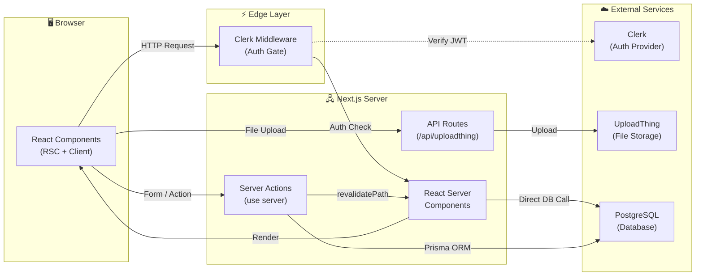
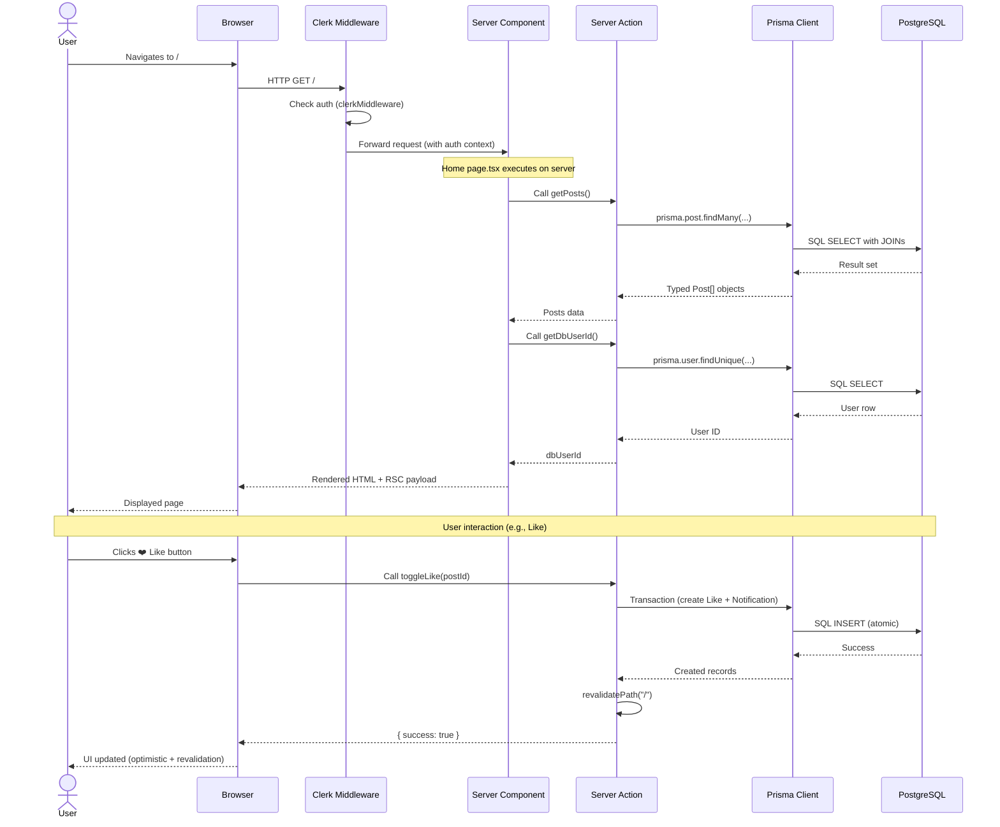
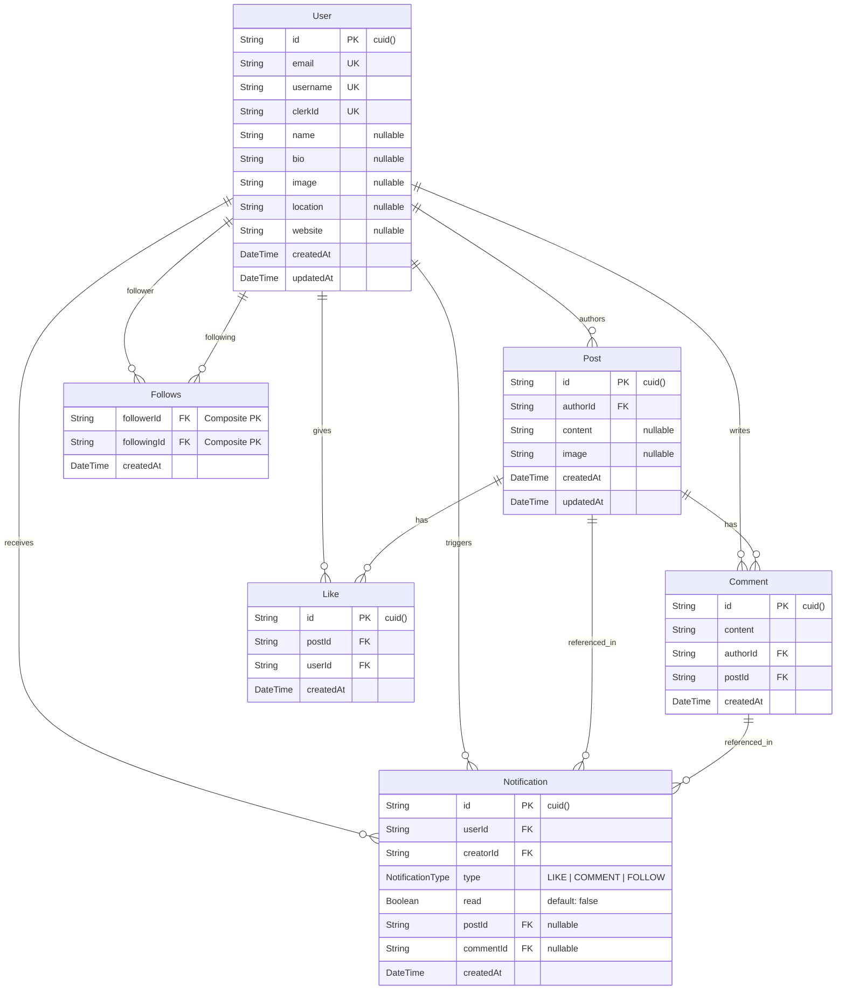
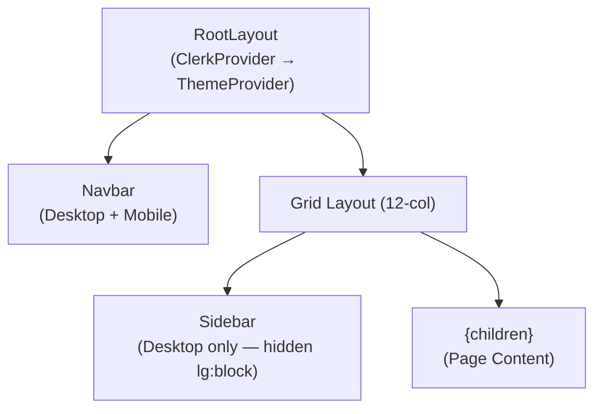
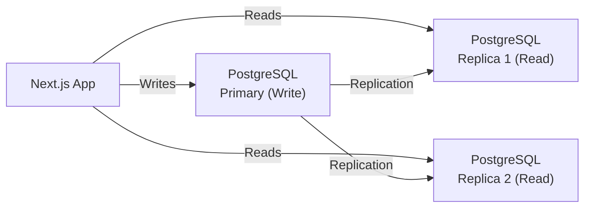

# SocialChain — Architecture Documentation

## Table of Contents

- [1. High-Level Architecture](#1-high-level-architecture)
- [2. Request Lifecycle](#2-request-lifecycle)
- [3. File Structure](#3-file-structure)
- [4. Database Schema (Mermaid ER Diagram)](#4-database-schema)
- [5. Frontend Routes (Pages)](#5-frontend-routes-pages)
- [6. Backend: Server Actions & API Routes](#6-backend-server-actions--api-routes)
- [7. Scaling Strategies](#7-scaling-strategies)

---

## 1. High-Level Architecture

SocialChain is a **full-stack social media platform** built with the **Next.js 14 App Router**. It uses a monolithic architecture where the frontend and backend coexist in a single Next.js application.



### Tech Stack

| Layer | Technology | Purpose |
|-------|-----------|---------|
| **Framework** | Next.js 14 (App Router) | Full-stack React framework with SSR/RSC |
| **Language** | TypeScript | Type safety across the stack |
| **Auth** | Clerk (`@clerk/nextjs`) | Authentication, user management, session handling |
| **Database** | PostgreSQL | Relational data storage |
| **ORM** | Prisma (`@prisma/client`) | Type-safe database queries & migrations |
| **File Uploads** | UploadThing | Image upload handling (max 4MB) |
| **Styling** | Tailwind CSS + shadcn/ui (Radix) | Utility-first CSS + accessible component primitives |
| **Theme** | `next-themes` | Dark/Light mode toggle |
| **Notifications** | `react-hot-toast` | Client-side toast notifications |

---

## 2. Request Lifecycle

Here's exactly how a request flows from the user's browser to the database and back:



### Entry Point Breakdown

1. **[middleware.ts](file:///c:/Users/Amartya/Dropbox/PC/Desktop/Projects/socialchain/src/middleware.ts)** — Every request hits Clerk middleware first. It runs on the Edge runtime and attaches auth context (`userId`, session) to the request. It matches all routes except static assets.

2. **[layout.tsx](file:///c:/Users/Amartya/Dropbox/PC/Desktop/Projects/socialchain/src/app/layout.tsx)** — Root layout wraps the entire app with:
   - `<ClerkProvider>` — Auth context for all components
   - `<ThemeProvider>` — Dark/Light mode
   - `<Navbar>` — Top navigation (desktop + mobile)
   - `<Sidebar>` — Left sidebar (desktop only, hidden on mobile)
   - `<Toaster>` — Toast notification container

3. **Page Components** — Each route's `page.tsx` is a **React Server Component** that fetches data directly via server actions, then renders client components with the data as props.

---

## 3. File Structure

```
socialchain/
├── prisma/
│   └── schema.prisma              # Database schema (6 models + 1 enum)
│
├── public/                         # Static assets (favicons, images)
│
├── src/
│   ├── middleware.ts               # 🔐 Clerk auth middleware (Edge)
│   │
│   ├── app/                        # 📄 Next.js App Router (pages + API)
│   │   ├── layout.tsx              #   Root layout (ClerkProvider, Theme, Navbar, Sidebar)
│   │   ├── page.tsx                #   Home feed (SSR — fetches all posts)
│   │   ├── globals.css             #   Global styles + Tailwind directives
│   │   ├── favicon.ico             #   App favicon
│   │   ├── fonts/                  #   Local fonts (Geist Sans + Mono)
│   │   │
│   │   ├── notifications/
│   │   │   └── page.tsx            #   Notifications page (Client Component)
│   │   │
│   │   ├── profile/
│   │   │   └── [username]/
│   │   │       ├── page.tsx            # Profile page (Server — fetches user data)
│   │   │       ├── ProfilePageClient.tsx  # Profile UI (Client Component)
│   │   │       └── not-found.tsx       # 404 for invalid usernames
│   │   │
│   │   └── api/
│   │       └── uploadthing/
│   │           ├── core.ts         #   UploadThing file router config
│   │           └── route.ts        #   UploadThing API handler (GET + POST)
│   │
│   ├── actions/                    # 🖧 Server Actions ("use server")
│   │   ├── user.action.ts          #   syncUser, getUserByClerkId, getDbUserId,
│   │   │                           #   getRandomUsers, toggleFollow
│   │   ├── post.action.ts          #   createPost, getPosts, toggleLike,
│   │   │                           #   createComment, deletePost
│   │   ├── profile.action.ts       #   getProfileByUsername, getUserPosts,
│   │   │                           #   getUserLikedPosts, updateProfile, isFollowing
│   │   └── notification.action.ts  #   getNotifications, markNotificationsAsRead
│   │
│   ├── components/                 # 🧩 React Components
│   │   ├── Navbar.tsx              #   Responsive navbar (desktop + mobile)
│   │   ├── DesktopNavbar.tsx       #   Desktop nav with Clerk UserButton
│   │   ├── MobileNavbar.tsx        #   Mobile nav with Sheet drawer
│   │   ├── Sidebar.tsx             #   Left sidebar (user info, stats)
│   │   ├── CreatePost.tsx          #   Post creation form with image upload
│   │   ├── PostCard.tsx            #   Post display (likes, comments, delete)
│   │   ├── FollowButton.tsx        #   Follow/Unfollow toggle button
│   │   ├── WhoToFollow.tsx         #   Suggested users widget
│   │   ├── ImageUpload.tsx         #   UploadThing image uploader
│   │   ├── DeleteAlertDialog.tsx   #   Confirmation dialog for post deletion
│   │   ├── ModeToggle.tsx          #   Dark/Light theme switcher
│   │   ├── ThemeProvider.tsx       #   next-themes provider wrapper
│   │   ├── NotificationSkeleton.tsx #  Loading skeleton for notifications
│   │   │
│   │   └── ui/                     #   shadcn/ui primitives (Radix-based)
│   │       ├── alert-dialog.tsx
│   │       ├── avatar.tsx
│   │       ├── button.tsx
│   │       ├── card.tsx
│   │       ├── dialog.tsx
│   │       ├── input.tsx
│   │       ├── label.tsx
│   │       ├── scroll-area.tsx
│   │       ├── separator.tsx
│   │       ├── sheet.tsx
│   │       ├── skeleton.tsx
│   │       ├── tabs.tsx
│   │       └── textarea.tsx
│   │
│   ├── lib/                        # 🔧 Shared utilities
│   │   ├── prisma.ts               #   Prisma client singleton (dev hot-reload safe)
│   │   ├── uploadthing.ts          #   UploadThing client helpers
│   │   └── utils.ts                #   cn() utility (clsx + tailwind-merge)
│   │
│   └── generated/
│       └── prisma/                 #   Auto-generated Prisma Client types
│
├── package.json                    # Dependencies & scripts
├── next.config.mjs                 # Next.js configuration
├── tailwind.config.ts              # Tailwind CSS configuration
├── tsconfig.json                   # TypeScript configuration
├── postcss.config.mjs              # PostCSS configuration
├── components.json                 # shadcn/ui configuration
└── .env                            # Environment variables (DB URL, Clerk keys, etc.)
```

---

## 4. Database Schema



### Key Schema Design Decisions

| Decision | Details |
|----------|---------|
| **Composite PK on Follows** | `@@id([followerId, followingId])` prevents duplicate follows at the DB level |
| **Unique constraint on Like** | `@@unique([userId, postId])` ensures one like per user per post |
| **Composite indexes** | `@@index([authorId, postId])` on Comment and `@@index([userId, postId])` on Like for faster lookups |
| **Cascade deletes** | All relations use `onDelete: Cascade` — deleting a User removes all their posts, comments, likes, and notifications |
| **Clerk ID mapping** | `clerkId` field on User bridges Clerk's auth identity to the app's internal user model |
| **Self-referential Follows** | Two `@relation` annotations (`"follower"` and `"following"`) on User create a many-to-many self-relation |

---

## 5. Frontend Routes (Pages)

| Route | File | Rendering | Description |
|-------|------|-----------|-------------|
| `/` | [page.tsx](file:///c:/Users/Amartya/Dropbox/PC/Desktop/Projects/socialchain/src/app/page.tsx) | **SSR** (Server Component) | Home feed — shows all posts, "Create Post" form (if logged in), and "Who to Follow" sidebar |
| `/notifications` | [page.tsx](file:///c:/Users/Amartya/Dropbox/PC/Desktop/Projects/socialchain/src/app/notifications/page.tsx) | **CSR** (Client Component) | Lists all notifications (likes, comments, follows). Auto-marks unread as read on mount |
| `/profile/[username]` | [page.tsx](file:///c:/Users/Amartya/Dropbox/PC/Desktop/Projects/socialchain/src/app/profile/%5Busername%5D/page.tsx) | **SSR → CSR** (Server fetches, Client renders) | User profile with tabs for "Posts" and "Liked Posts". Shows bio, stats, follow button, edit profile dialog |

### Layout Hierarchy



---

## 6. Backend: Server Actions & API Routes

### Server Actions (`"use server"`)

All business logic lives in server actions — there are **no traditional REST API endpoints** for CRUD operations. Next.js server actions are invoked directly from components via function calls.

#### [user.action.ts](file:///c:/Users/Amartya/Dropbox/PC/Desktop/Projects/socialchain/src/actions/user.action.ts)

| Function | Purpose | Auth Required |
|----------|---------|:---:|
| `syncUser()` | Creates/syncs Clerk user to DB on first login | ✅ |
| `getUserByClerkId(clerkId)` | Fetches user with follower/following/post counts | ❌ |
| `getDbUserId()` | Maps current Clerk session to internal DB user ID | ✅ |
| `getRandomUsers()` | Returns 3 unfollowed users for "Who to Follow" | ✅ |
| `toggleFollow(targetUserId)` | Follow/Unfollow + creates FOLLOW notification (transaction) | ✅ |

#### [post.action.ts](file:///c:/Users/Amartya/Dropbox/PC/Desktop/Projects/socialchain/src/actions/post.action.ts)

| Function | Purpose | Auth Required |
|----------|---------|:---:|
| `createPost(content, imageUrl)` | Creates a new post with optional image | ✅ |
| `getPosts()` | Fetches all posts with author, comments, likes (sorted by newest) | ❌ |
| `toggleLike(postId)` | Like/Unlike + creates LIKE notification (transaction) | ✅ |
| `createComment(postId, content)` | Adds comment + creates COMMENT notification (transaction) | ✅ |
| `deletePost(postId)` | Deletes post (only by author) | ✅ |

#### [profile.action.ts](file:///c:/Users/Amartya/Dropbox/PC/Desktop/Projects/socialchain/src/actions/profile.action.ts)

| Function | Purpose | Auth Required |
|----------|---------|:---:|
| `getProfileByUsername(username)` | Fetches user profile with stats | ❌ |
| `getUserPosts(userId)` | Fetches all posts by a specific user | ❌ |
| `getUserLikedPosts(userId)` | Fetches all posts liked by a specific user | ❌ |
| `updateProfile(formData)` | Updates name, bio, location, website | ✅ |
| `isFollowing(userId)` | Checks if current user follows target user | ✅ |

#### [notification.action.ts](file:///c:/Users/Amartya/Dropbox/PC/Desktop/Projects/socialchain/src/actions/notification.action.ts)

| Function | Purpose | Auth Required |
|----------|---------|:---:|
| `getNotifications()` | Fetches all notifications for current user with creator, post, comment details | ✅ |
| `markNotificationsAsRead(ids)` | Batch updates notifications to `read: true` | ✅ |

### API Routes (Traditional REST)

| Method | Route | File | Purpose |
|--------|-------|------|---------|
| `GET` | `/api/uploadthing` | [route.ts](file:///c:/Users/Amartya/Dropbox/PC/Desktop/Projects/socialchain/src/app/api/uploadthing/route.ts) | UploadThing status/config endpoint |
| `POST` | `/api/uploadthing` | [route.ts](file:///c:/Users/Amartya/Dropbox/PC/Desktop/Projects/socialchain/src/app/api/uploadthing/route.ts) | Handle image uploads (authenticated, max 4MB) |

> [!NOTE]
> The only traditional API route is for UploadThing file uploads. All other data mutations use Next.js Server Actions, which are RPC-style function calls that Next.js automatically turns into POST requests under the hood.

---

## 7. Scaling Strategies

### Current Bottlenecks

| Bottleneck | Issue |
|-----------|-------|
| **`getPosts()` fetches ALL posts** | No pagination — loads every post in the database on the home feed |
| **No caching layer** | Every page load hits the database directly |
| **Single database** | PostgreSQL is the single point of failure |
| **Synchronous notifications** | Notifications are created in the same transaction as the action |
| **No CDN for images** | UploadThing handles storage, but no edge caching |

### Short-Term Improvements (Low Effort, High Impact)

#### 1. Add Cursor-Based Pagination
```typescript
// Instead of fetching ALL posts:
export async function getPosts(cursor?: string, limit = 20) {
  return prisma.post.findMany({
    take: limit,
    skip: cursor ? 1 : 0,
    cursor: cursor ? { id: cursor } : undefined,
    orderBy: { createdAt: "desc" },
    // ...existing includes
  });
}
```

#### 2. Add Redis Caching
- Cache hot data: user profiles, post counts, follower counts
- Use `unstable_cache` from Next.js or integrate Redis (Upstash) for distributed caching
- Set TTLs: 60s for feed, 300s for profiles

#### 3. Database Connection Pooling
- Use **PgBouncer** or **Prisma Accelerate** to pool connections
- Current singleton pattern helps in dev, but production needs proper pooling

#### 4. Add Database Indexes
The schema already has good composite indexes. Additional ones to consider:
```prisma
// On Post for feed queries
@@index([createdAt])

// On Notification for unread count queries
@@index([userId, read])
```

### Medium-Term Improvements (Moderate Effort)

#### 5. Move to ISR + On-Demand Revalidation
- Use `revalidateTag()` instead of `revalidatePath("/")` for more granular cache invalidation
- Tag posts by author, allowing targeted revalidation

#### 6. Background Job Queue for Notifications
- Move notification creation out of the main transaction
- Use a queue (BullMQ, Inngest, or Trigger.dev) to process notifications asynchronously
- This prevents notification failures from rolling back likes/comments

#### 7. Image Optimization
- Use Next.js `<Image>` component with `next/image` for automatic optimization
- Set up a CDN (CloudFront / Vercel Edge Network) in front of UploadThing URLs

#### 8. Rate Limiting
- Add rate limiting middleware for server actions (especially `createPost`, `toggleLike`)
- Use Upstash Ratelimit or similar

### Long-Term Scaling (High Effort)

#### 9. Read Replicas


#### 10. Microservices Extraction
If traffic grows significantly, extract these into separate services:
- **Notification Service** — Separate service with its own DB, consuming events from a message queue (Kafka/RabbitMQ)
- **Feed Service** — Pre-computed feed using fan-out-on-write pattern
- **Media Service** — Dedicated image processing pipeline (resize, compress, CDN)

#### 11. Real-Time Features
- Add WebSocket or SSE for live notifications (Pusher, Ably, or Next.js Server-Sent Events)
- Currently notifications require a page refresh to appear

#### 12. Search & Discovery
- Add full-text search with PostgreSQL `tsvector` or Elasticsearch/Meilisearch
- Implement hashtags, trending topics, and explore page

### Scaling Priority Matrix

| Priority | Action | Impact | Effort |
|----------|--------|--------|--------|
| 🔴 **P0** | Add pagination to `getPosts()` | 🟢 High | 🟢 Low |
| 🔴 **P0** | Add `<Image>` optimization | 🟢 High | 🟢 Low |
| 🟡 **P1** | Redis caching (Upstash) | 🟢 High | 🟡 Medium |
| 🟡 **P1** | Connection pooling (Prisma Accelerate) | 🟡 Medium | 🟢 Low |
| 🟡 **P1** | Background notification queue | 🟡 Medium | 🟡 Medium |
| 🔵 **P2** | Read replicas | 🟢 High | 🔴 High |
| 🔵 **P2** | Real-time notifications | 🟡 Medium | 🟡 Medium |
| ⚪ **P3** | Microservices extraction | 🟢 High | 🔴 Very High |
| ⚪ **P3** | Full-text search | 🟡 Medium | 🟡 Medium |
